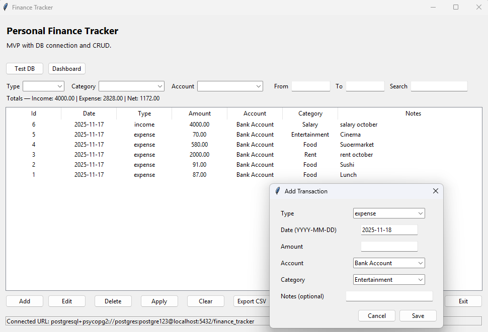
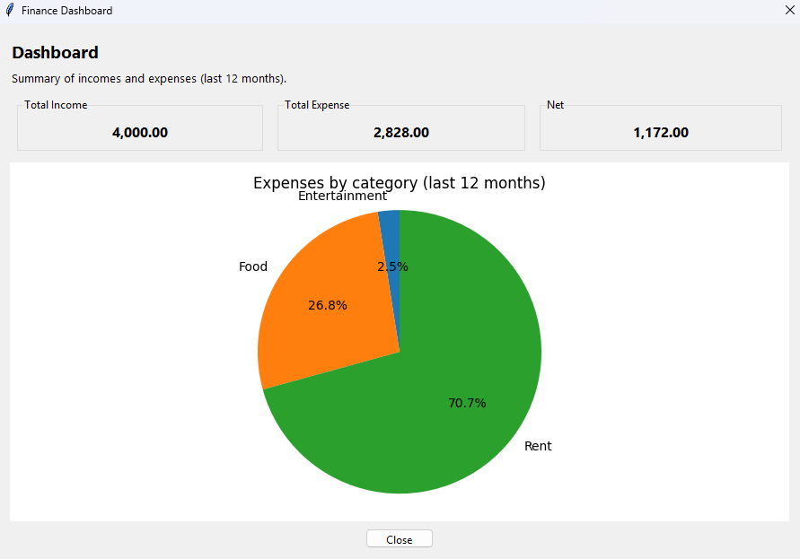

# 💰 Personal Finance Tracker

A simple yet powerful **personal finance management app** built with **Python**, **PostgreSQL**, and **Docker**.  
This project demonstrates real backend architecture using **SQLAlchemy ORM**, **Alembic migrations**, and **data seeding scripts** — all developed and managed entirely on **Linux (Ubuntu + Neovim)**.

---

## 📘 Overview

The `finance-tracker` application is designed to help users organize their **expenses**, **income**, and **accounts** with clarity and structure.  
It includes full database migration management and version control using **Alembic**.

### 🧩 Implemented so far:
| Feature | Description |
|----------|--------------|
| 🗂️ **Categories Table** | Stores transaction categories such as “Food”, “Salary”, “Rent”, etc. |
| 💳 **Accounts Table** | Represents financial accounts like “Wallet”, “Bank Account”, or “Savings”. |
| 🔁 **Transactions Table** | Tracks all income and expenses with foreign keys and constraints. |
| ⚙️ **Alembic Migrations** | Versioned database schema management. |
| 🌱 **Seed Script** | Automatic population of initial categories directly in PostgreSQL. |

---

## 🔱 Project Logo


## 💸 Transactions Screen


## 📊 Dashboard Example


---

## ⚙️ Tech Stack

- 🐍 **Python 3.12**
- 🗃️ **PostgreSQL 16**
- 🐳 **Docker & Docker Compose**
- 🧱 **SQLAlchemy ORM**
- 🔄 **Alembic Migrations**
- 🌿 **Python Dotenv** (for environment configuration)
- 🧠 **Linux + Neovim Development Setup**

---

## 🧭 Project Structure
```bash
finance-tracker/
├── alembic/
│ ├── versions/
│ ├── env.py
│ ├── script.py.mako
│ └── README
├── scripts/
│ └── seed_categories.py
├── .env
├── Dockerfile
├── docker-compose.yml
└── README.md
```

---

## 🐳 Docker Setup

### 1️⃣ Build and start the services
```bash
docker compose up --build -d
```

### 2️⃣ Verify that both containers are running
```bash
docker compose ps
```

---

## 🧱 Database Migrations with Alembic
Create a new migration
```bash
alembic revision -m "add new table or column"
```

Apply migrations
```bash
alembic upgrade head
```

Check migration history
```bash
alembic history --verbose
```

---

## 💡 Development Highlights

- Built and tested entirely inside Linux (Ubuntu)
- Managed with Neovim, tmux, and Docker CLI
- Fully reproducible through versioned migrations (alembic/versions)
- Consistent environment setup for local or cloud deployment

---

## 🪟 Windows Build & Installer Support

The project now includes a full Windows desktop build, packaged as a standalone .exe application with installer, icon, and PostgreSQL connection — making it a real-world desktop software.

✔️ What was added on Windows
| Feature                                    | Description                                                                                     |
| ------------------------------------------ | ----------------------------------------------------------------------------------------------- |
| 🖥️ **Standalone EXE (PyInstaller)**       | Full executable build that runs without Python installed.                                       |
| 📦 **Professional Installer (Inno Setup)** | Creates Start Menu shortcut, Desktop shortcut, and adds the app to Windows Programs & Features. |
| 🪪 **Custom Premium Icon (.ico)**          | High-quality gold-themed finance icon used for the EXE and installer.                           |
| 🔧 **Automatic `env` Injection**           | `.env` is copied into the executable folder for DB configuration.                               |
| 🐘 **Native PostgreSQL on Windows**        | Fully connected to PostgreSQL 16 running locally.                                               |
| 🚀 **Docker Optional**                     | Can run using Windows PostgreSQL OR Docker-based PostgreSQL.                                    |

---

## 🚀 Windows Installation Workflow

1️⃣ Build the EXE
```
pyinstaller --noconfirm --windowed --icon=finance_tracker_icon.ico app/gui.py
```
The build outputs to:
```
/dist/finance-tracker.exe
```

2️⃣ Copy environment variables
```
copy .env dist\.env
```

3️⃣ Create installer using Inno Setup

The script used:
```
[Setup]
AppName=Finance Tracker
AppVersion=1.0
DefaultDirName={pf}\Finance Tracker
DefaultGroupName=Finance Tracker
OutputDir=installer
OutputBaseFilename=finance-tracker-installer
SetupIconFile=finance_tracker_icon.ico

[Files]
Source: "dist\*"; DestDir: "{app}"; Flags: ignoreversion recursesubdirs

[Icons]
Name: "{autoprograms}\Finance Tracker"; Filename: "{app}\finance-tracker.exe"
Name: "{autodesktop}\Finance Tracker"; Filename: "{app}\finance-tracker.exe"
```
---

## 🖼️ Final Result (Windows)

- ✔️ App installs like real software
- ✔️ Desktop shortcut created automatically
- ✔️ Custom golden icon applied
- ✔️ Connects to PostgreSQL correctly
- ✔️ Fully functional GUI (accounts, categories, dashboard, filters)

---

## 📦 Portable Version (Optional)
```bash
dist/
│── finance-tracker.exe
│── .env
│── all required DLL + Python runtime
```
This version runs without installation.

---

## 🛡️ Error Handling & Debug Mode

The Windows executable supports debug testing via:
```
finance-tracker-checkdb
```
Which checks:

- PostgreSQL access
- .env parsing
- Connection string validity

---

## 📜 License

* This project is released under the MIT License.
* Feel free to use, modify, and learn from it.

---

## 🧑‍💻 Author

Marcos Vinicius Thibes Kemer


